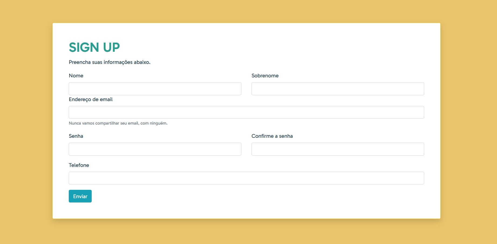

# Formulário com Bootstrap ✨📝

Bem-vindo ao meu repositório de formulário! Aqui você encontrará um formulário estiloso criado com o poderoso framework Bootstrap, além de uma pitada de conhecimento em HTML e CSS. 😄🎩

Confira o projeto [AQUI](https://germanavaz.github.io/formulario-bootstrap/)!

## ✨ Sobre o Projeto

Este repositório é o resultado da minha exploração ao mundo do Bootstrap e do design de formulários web. O objetivo era criar um formulário de sign up para alguma plataforma.

## 🚀 Tecnologias Utilizadas

- Bootstrap
- HTML
- CSS

## 📝 O que Você Encontrará

Este projeto inclui:

- Um formulário mágico e responsivo que se adapta a qualquer tamanho de tela.
- Uma pitada de magia Bootstrap para tornar tudo isso possível!
